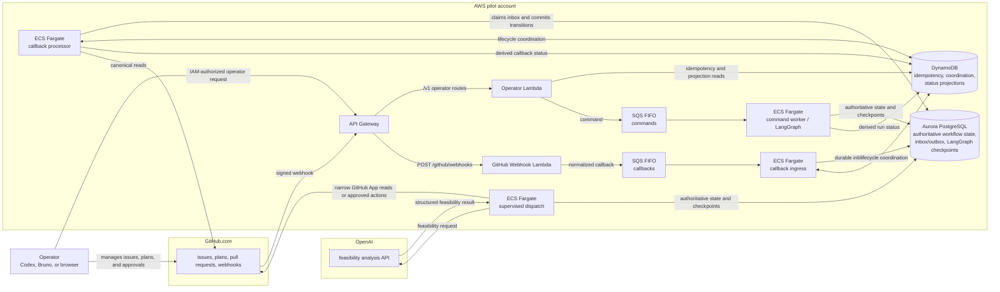
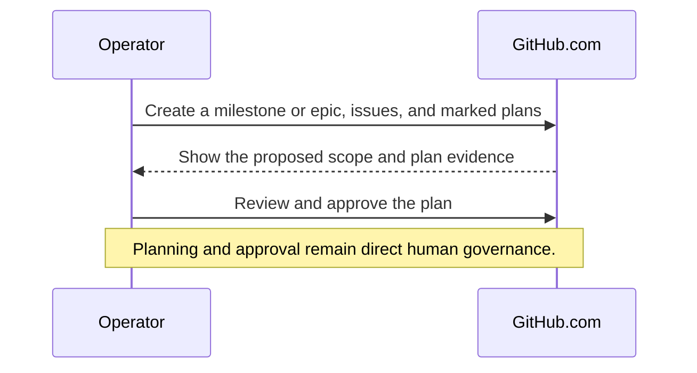
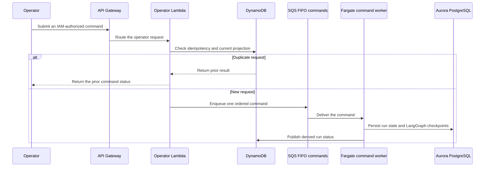
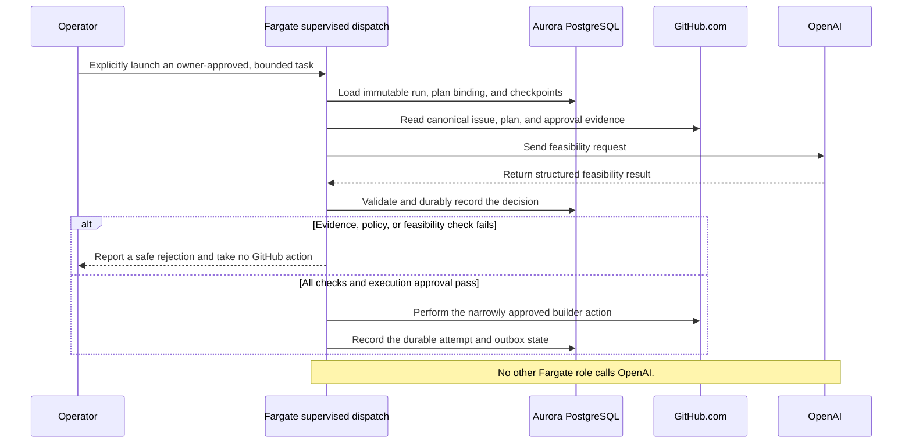
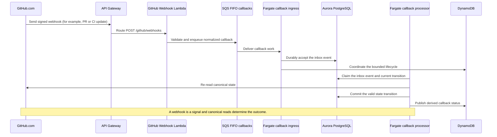
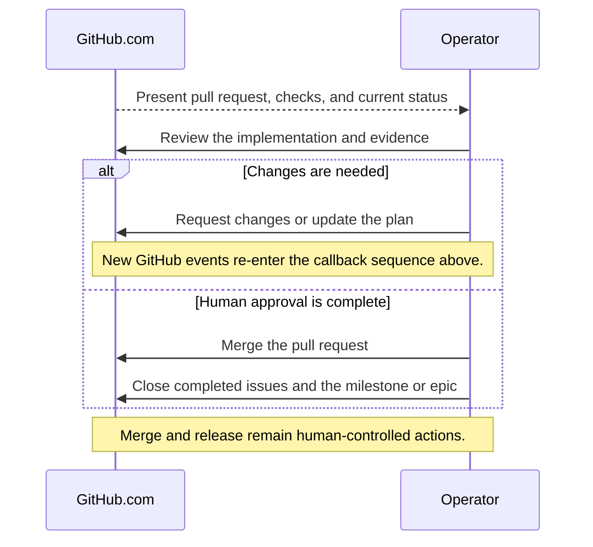

# Architecture diagram

This diagram is a learning-oriented view of the intended pilot architecture. It
separates the human governance path from the two runtime entry paths: operator
commands and GitHub callbacks. It does not imply that every integration is
enabled in every environment.

## How to read it

- **Human governance is direct.** You use GitHub directly to create issues,
  milestones, plans, and approvals. Those human actions are distinct from
  machine processing.
- **Event delivery is signed.** GitHub sends a signed webhook to API Gateway. The
  webhook Lambda validates it before placing a normalized event on the
  callbacks queue.
- **PostgreSQL is authoritative.** Workflow state, legal transitions, inbox
  and outbox records, and LangGraph checkpoints live there.
- **DynamoDB supports speed and coordination.** It records request
  idempotency, callback-task lifecycle state, and derived status projections.
  A missing or stale projection must not override PostgreSQL.
- **The two SQS queues have different purposes.** The operator API emits
  commands; GitHub webhooks produce callbacks. Each queue has its own DLQ.
- **OpenAI is deliberately isolated.** The supervised-dispatch Fargate task
  sends feasibility requests to OpenAI and receives structured feasibility
  results. Callback processing does not call OpenAI.
- **GitHub has both inbound and outbound arrows.** Webhooks enter through the
  callback path. Canonical reads and narrowly approved GitHub App operations
  leave only through bounded worker paths.

## Milestone or epic lifecycle

Read these diagrams from top to bottom. Together they show the intended journey
from defining a milestone or epic to human-controlled completion. They describe
the authority boundaries, not an assertion that every runtime is currently
enabled.

### 1. Plan and approve the work

### 2. Submit and durably start an orchestrator run

### 3. Run the isolated feasibility and dispatch path

### 4. Process GitHub events without trusting delivery alone

### 5. Review, merge, and complete the milestone

## Runtime availability

The diagram describes the intended pilot architecture and its authority
boundaries. It is not a claim that all arrows are currently live: ordinary
worker composition is stub-only, and provider access and callback processing
remain separately gated. See [Architecture](./architecture.md) for the
implemented contracts and current rollout boundaries.
